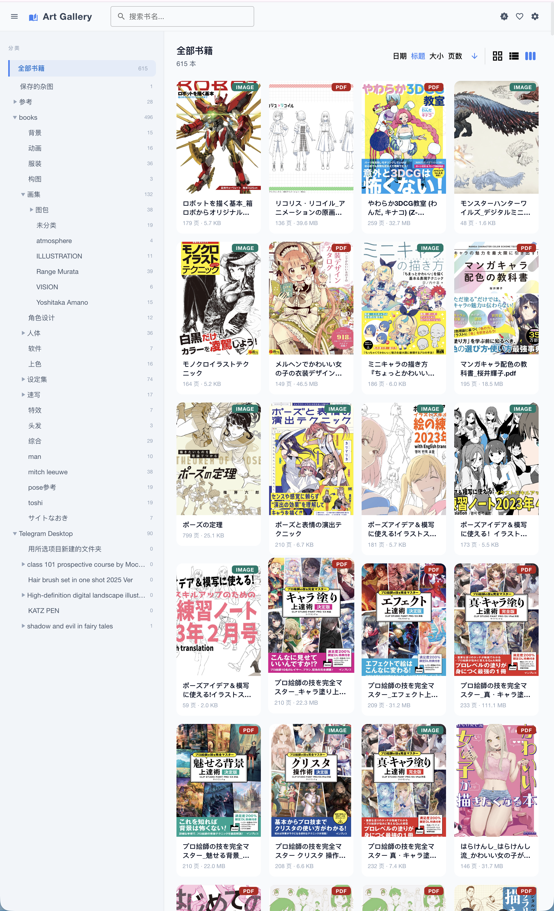
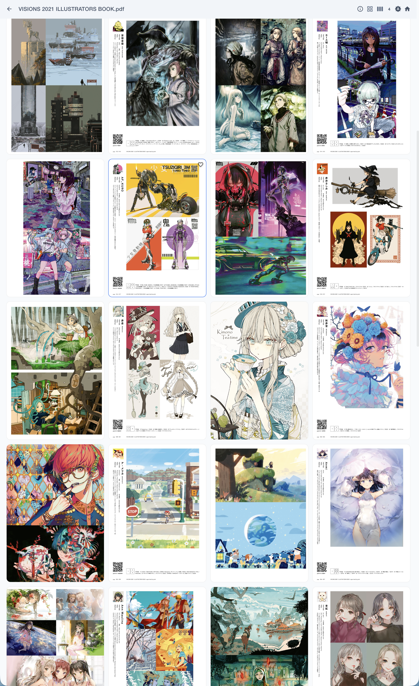

# AwareNote / Art Gallery

[](./LICENSE)

[English](#english) | [中文](#中文) | [日本語](#日本語)

---

## English

### Overview

AwareNote (Art Gallery) is a **local-first digital art book and comic management application**. It transforms your scattered image packages, PDF files, and art collections into an elegantly organized **Pinterest-style masonry gallery** — all without touching your original files.

**Core Advantages:**
- **Zero Intrusion**: Scanning only records metadata; your files remain untouched
- **One-click Organization**: Automatically discovers and catalogs image folders, PDFs, and loose image collections as books
- **Pinterest-style Gallery**: Beautiful masonry layout for browsing covers and pages
- **Multi-format Ready**: Handles PDF files, image folders (JPG, PNG, WebP, GIF), and mixed collections

### Core Features

- **Multi-format Support**: Handles PDF files and image-based books (JPG, PNG, WebP, GIF)
- **Automatic Scanning**: Discovers and indexes books from configured folder paths; supports multiple scan paths with overlap detection
- **Category Management**: Organize books into custom categories
- **Favorites & Collections**: Mark and manage favorite pages across books
- **Spread (Dual-page) Management**: Manually or automatically group pages as spreads for manga/comic reading
- **Reading Direction**: Supports Left-to-Right (LTR) and Right-to-Left (RTL) layouts
- **High-performance Rendering**: PDF pages rendered to SVG; oversized images auto-sampled
- **Intelligent Caching**: Content-signature based cache invalidation (FNV hash); avoids re-processing unchanged files
- **Streaming Scan Progress**: Real-time SSE logs during library scanning
- **Dark/Light Mode**: Toggle with keyboard shortcut, persisted to local storage
- **Keyboard Navigation**: Arrow keys / Space for page navigation in reader
- **Multiple Fit Modes**: Fit to width, fit to screen, or original size
- **Native macOS Integration**: Settings app built with SwiftUI, follows macOS design guidelines
- **System Tray**: Runs in background with system tray icon (tao + tray-icon)
- **Graceful Shutdown**: Handles Ctrl+C and SIGTERM for clean shutdown

### Tech Stack

| Layer | Technology |
|-------|------------|
| **Backend** | Rust, Axum, Tokio, Sea-ORM, SQLite |
| **PDF Rendering** | MuPDF, image, fast_image_resize |
| **Frontend** | Vue 3, Quasar, Pinia, TypeScript, Vite |
| **Native macOS** | SwiftUI, tao, tray-icon |
| **macOS Settings** | SwiftUI (native settings app bundled in `.app`) |

### Architecture

```
awarenotes/
├── src/                          # Rust Backend (Axum)
│   ├── bin/awarenotes.rs         # Entry point
│   ├── routes/                   # API route modules
│   ├── handlers/                 # Request handlers
│   ├── domain/                   # Domain models (books, categories, libraries...)
│   ├── scanner/                  # File scanning engine
│   │   ├── engine.rs             # Scan scheduler
│   │   ├── strategy.rs           # File recognition (PDF / image folder)
│   │   ├── pdf.rs                # PDF parsing helper
│   │   └── types.rs              # Scan data types
│   ├── service/                  # Core services (database, cache, assets)
│   └── config.rs                 # Config loading & validation
├── art-gallery/                  # Vue 3 Frontend
│   └── src/
│       ├── pages/                # Route pages
│       │   ├── GalleryPage.vue   # Book gallery
│       │   ├── DetailPage.vue    # Book detail + masonry
│       │   ├── ReaderPage.vue    # Reader
│       │   ├── FavoritesPage.vue # Favorites (virtual book)
│       │   └── SettingsPage.vue  # Web settings page
│       └── stores/               # Pinia state management
├── native-macos/                 # macOS Native Settings App
│   ├── AwarenotesSettings.swift  # SwiftUI settings UI
│   └── *.plist                   # App Bundle configs
└── scripts/
    └── build-macos-app.sh        # macOS packaging script
```

### Configuration

Config file: `~/Library/Application Support/awarenotes/app_config.toml`

```toml
[server]
app_name = "AwareNote"
host = "0.0.0.0"
port = 3001

[scanner]
scan_paths = ["/path/to/your/library"]
image_extensions = ["jpg", "jpeg", "png", "webp", "gif"]
min_image_count = 3

[cache]
cover_width = 960
image_page_preview_width = 1600
oversized_image_avg_pixels = 10000000
pdf_svg_width = 1400
max_render_jobs = 4
```

### Screenshots

| Description | Preview |
|-------------|---------|
| **Main Interface** - Split-screen display with sidebar category tree and main gallery area |  |
| **Book Gallery** - Masonry waterfall layout showcasing book covers |  |
| **Spread View** - Dual-page spread layout for manga/comic reading |  |
| **Favorites** - Collection view of bookmarked pages across books |  |

### Build & Run

#### macOS

```bash
# Clone the repository
git clone https://github.com/yourusername/awarenotes.git
cd awarenotes

# Run the packaging script
./scripts/build-macos-app.sh
```

The built application will be at `native-macos/dist/AwareNote.app`.

> ⚠️ **Unsigned App Warning**: Since this app is not code-signed, macOS may block it on first run. Run `xattr -cr /Applications/AwareNote.app` in terminal to unquarantine.

> ⚠️ **Disclaimer**: This project was built with vibe coding. Code quality is not guaranteed — read at your own risk! Using AI assistants to navigate the codebase is highly recommended.

#### Windows

> **Note**: Windows compatibility is not guaranteed. The following steps are provided as-is for manual builds.

**Backend (Rust)**:

```bash
cargo build --release --bin awarenotes
```

**Frontend (Vue)**:

```bash
cd art-gallery
npm install
npm run build
```

Copy the frontend build output to the backend's static directory as configured.

---

## 中文

### 概述

AwareNote（Art Gallery）是一款**本地优先的数字画册与漫画管理应用**。它可以将散落的图包、PDF 文件、杂图集合整理成美观的 **Pinterest 风格瀑布流画廊**，对你的原文件**零侵入**。

**核心优势：**
- **零侵入**：扫描仅记录信息，不修改、不移动你的原文件
- **一键整理**：自动发现并索引图片文件夹、PDF 文件、杂图包，统一管理为"书籍"
- **Pinterest 风格瀑布流**：美观的多列布局展示书籍封面和页面
- **多格式支持**：PDF 文件、图片文件夹（JPG、PNG、WebP、GIF）、混合图包

### 核心功能

- **多格式支持**：支持 PDF 文件和图片类书籍（JPG、PNG、WebP、GIF）
- **自动扫描**：自动从配置的文件夹中发现并索引书籍；支持多扫描路径与重叠检测
- **分类管理**：将书籍整理到自定义分类中
- **收藏与精选**：跨书籍标记和管理喜欢的页面
- **拼页（Spread）管理**：手动或自动将页面组合为双页 spread，适合漫画阅读
- **阅读方向**：支持从左到右（LTR）和从右到左（RTL）排版
- **高性能渲染**：PDF 页面渲染为 SVG；超大图片自动抽样
- **智能缓存**：基于内容签名（FNV hash）的缓存失效机制；避免重复处理未变更文件
- **流式扫描进度**：扫描库时实时 SSE 日志推送
- **明暗主题切换**：支持键盘快捷键切换，状态持久化到本地存储
- **键盘翻页导航**：阅读器支持方向键 / 空格翻页
- **多种适应模式**：适应宽度、适应屏幕、原始大小
- **原生 macOS 集成**：设置界面使用 SwiftUI 构建，符合 macOS 设计规范
- **系统托盘**：支持后台运行，带系统托盘图标
- **优雅关闭**：处理 Ctrl+C 和 SIGTERM 信号实现干净退出

### 技术栈

| 层级 | 技术 |
|------|------|
| **后端** | Rust, Axum, Tokio, Sea-ORM, SQLite |
| **PDF 渲染** | MuPDF, image, fast_image_resize |
| **前端** | Vue 3, Quasar, Pinia, TypeScript, Vite |
| **macOS 原生** | SwiftUI, tao, tray-icon |
| **macOS 设置** | SwiftUI（原生设置应用集成在 `.app` 中） |

### 项目架构

```
awarenotes/
├── src/                          # Rust 后端 (Axum)
│   ├── bin/awarenotes.rs         # 程序入口
│   ├── routes/                   # API 路由模块
│   ├── handlers/                 # 请求处理器
│   ├── domain/                   # 领域模型 (books, categories, libraries...)
│   ├── scanner/                  # 文件扫描引擎
│   │   ├── engine.rs             # 扫描调度器
│   │   ├── strategy.rs           # 文件识别策略（PDF / 图片文件夹）
│   │   ├── pdf.rs                # PDF 解析辅助
│   │   └── types.rs              # 扫描数据类型
│   ├── service/                  # 核心服务 (database, cache, assets)
│   └── config.rs                 # 配置加载与验证
├── art-gallery/                  # Vue 3 前端
│   └── src/
│       ├── pages/                # 路由页面
│       │   ├── GalleryPage.vue   # 书库画廊
│       │   ├── DetailPage.vue    # 书籍详情 + 瀑布流
│       │   ├── ReaderPage.vue    # 阅读器
│       │   ├── FavoritesPage.vue # 收藏页（虚拟书）
│       │   └── SettingsPage.vue  # Web 设置页
│       └── stores/               # Pinia 状态管理
├── native-macos/                 # macOS 原生设置应用
│   ├── AwarenotesSettings.swift  # SwiftUI 设置界面
│   └── *.plist                   # App Bundle 配置
└── scripts/
    └── build-macos-app.sh        # macOS 打包脚本
```

### 配置文件

配置文件位于 `~/Library/Application Support/awarenotes/app_config.toml`：

```toml
[server]
app_name = "AwareNote"
host = "0.0.0.0"
port = 3001

[scanner]
scan_paths = ["/path/to/your/library"]
image_extensions = ["jpg", "jpeg", "png", "webp", "gif"]
min_image_count = 3

[cache]
cover_width = 960
image_page_preview_width = 1600
oversized_image_avg_pixels = 10000000
pdf_svg_width = 1400
max_render_jobs = 4
```

### 截图展示

| 描述 | 预览 |
|------|------|
| **主界面** - 竖屏分割显示器，左侧分类树 + 右侧画廊区域 |  |
| **书籍瀑布流** - 瀑布流布局展示书籍封面 |  |
| **Spread 视图** - 双页拼页布局，适合漫画阅读 |  |
| **收藏界面** - 跨书籍收藏页面的集合展示 |  |

### 构建与运行

#### macOS

```bash
# 克隆仓库
git clone https://github.com/yourusername/awarenotes.git
cd awarenotes

# 执行打包脚本
./scripts/build-macos-app.sh
```

构建产物位于 `native-macos/dist/AwareNote.app`。

> ⚠️ **未签名提示**：由于应用未进行代码签名，下载后首次运行会被 macOS 拦截。请在终端执行 `xattr -cr /Applications/AwareNote.app` 解除限制。

> ⚠️ **免责声明**：本项目全程采用 vibe coding 编写，质量不能保证，请自行判断使用风险！建议使用 AI 助手阅读理解代码。

#### Windows

> **注意**：不保证 Windows 兼容性。以下步骤仅供手动构建参考。

**后端（Rust）**：

```bash
cargo build --release --bin awarenotes
```

**前端（Vue）**：

```bash
cd art-gallery
npm install
npm run build
```

将前端构建产物复制到后端配置的静态资源目录。

---

## 日本語

### 概要

AwareNote（Art Gallery）は、**ローカル優先のデジタル画集・漫画管理アプリケーション**です。散らかった画像パッケージ、PDFファイル、雑多な画像コレクションを美しい **Pinterest 風のウォーターフォールギャラリー**に整理します。元のファイルに**一切手を加えません**。

**コア優位性：**
- **非侵入**: スキャンはメタデータを記録するだけで、元のファイルは変更されません
- **一括整理**: 画像フォルダ、PDFファイル、雑多な画像パッケージを自動検出・インデックス化し、「本」として統一管理
- **Pinterest 風ウォーターフォール**: 書籍のカバーとページを美しく多段レイアウトで表示
- **マルチフォーマット対応**: PDFファイル、画像フォルダ（JPG、PNG、WebP、GIF）、混合パッケージ

### コア機能

- **マルチフォーマット対応**: PDF ファイルと画像ベースの本（JPG、PNG、WebP、GIF）をサポート
- **自動スキャン**: 設定したフォルダパスから本を自動検出・インデックス化；複数スキャン経路と重叠検出をサポート
- **カテゴリ管理**: 本をカスタムカテゴリに整理
- **お気に入り・コレクション**: 複数書籍をまたいでページをお気に入りに追加・管理
- **スプレッド（見開き）管理**: ページを見開き（ダブルページ）として手動または自動で構成、漫画読者に最適
- **読む方向**: 左から右（LTR）および右から左（RTL）レイアウトをサポート
- **高性能レンダリング**: PDF ページは SVG にレンダリング、超大画像は自動サンプリング
- **インテリジェントキャッシュ**: コンテンツ署名（FNVハッシュ）ベースのキャッシュ無効化；未変更ファイルを再処理しない
- **ストリーミングスキャン進捗**: ライブラリスキャン中のリアルタイムSSEログ
- **ダーク/ライトモード**: キーボードショートカットで切り替え、ローカルストレージに永続化
- **キーボードナビゲーション**: リーダーで矢印キー/スペース用于ページナビゲーション
- **複数のフィットモード**: 幅に合わせる、画面に合わせる、オリジナルサイズ
- **macOS ネイティブ統合**: 設定アプリは SwiftUI で構築、macOS デザインガイドラインに準拠
- **システムトレイ**: バックグラウンド運行をサポート、システムトレイアイコン付き
- **優雅なシャットダウン**: Ctrl+C と SIGTERM を処理してクリーンシャットダウン

### 技術スタック

| レイヤー | 技術 |
|----------|------|
| **バックエンド** | Rust, Axum, Tokio, Sea-ORM, SQLite |
| **PDF レンダリング** | MuPDF, image, fast_image_resize |
| **フロントエンド** | Vue 3, Quasar, Pinia, TypeScript, Vite |
| **macOS ネイティブ** | SwiftUI, tao, tray-icon |
| **macOS 設定** | SwiftUI（ネイティブ設定アプリが `.app` にバンドル済み） |

### アーキテクチャ

```
awarenotes/
├── src/                          # Rust バックエンド (Axum)
│   ├── bin/awarenotes.rs         # エントリーポイント
│   ├── routes/                   # API ルートモジュール
│   ├── handlers/                 # リクエストハンドラ
│   ├── domain/                   # ドメインモデル (books, categories, libraries...)
│   ├── scanner/                  # ファイルスキャンエンジン
│   │   ├── engine.rs             # スキャンパスケジューラー
│   │   ├── strategy.rs           # ファイル認識（PDF / 画像フォルダ）
│   │   ├── pdf.rs                # PDF 解析ヘルパー
│   │   └── types.rs              # スキャン数据类型
│   ├── service/                  # コアサービス (database, cache, assets)
│   └── config.rs                 # 設定加载と検証
├── art-gallery/                  # Vue 3 フロントエンド
│   └── src/
│       ├── pages/                # ルートページ
│       │   ├── GalleryPage.vue   # ギャラリー
│       │   ├── DetailPage.vue    # 詳細 + ウォーターフォール
│       │   ├── ReaderPage.vue    # リーダー
│       │   ├── FavoritesPage.vue # お気に入り（仮想本）
│       │   └── SettingsPage.vue  # Web 設定ページ
│       └── stores/               # Pinia 状態管理
├── native-macos/                 # macOS ネイティブ設定アプリ
│   ├── AwarenotesSettings.swift  # SwiftUI 設定UI
│   └── *.plist                   # App Bundle 設定
└── scripts/
    └── build-macos-app.sh        # macOS パッケージスクリプト
```

### 設定ファイル

設定ファイル: `~/Library/Application Support/awarenotes/app_config.toml`

```toml
[server]
app_name = "AwareNote"
host = "0.0.0.0"
port = 3001

[scanner]
scan_paths = ["/path/to/your/library"]
image_extensions = ["jpg", "jpeg", "png", "webp", "gif"]
min_image_count = 3

[cache]
cover_width = 960
image_page_preview_width = 1600
oversized_image_avg_pixels = 10000000
pdf_svg_width = 1400
max_render_jobs = 4
```

### スクリーンショット

| 説明 | プレビュー |
|------|-----------|
| **メイン画面** - 竖型分割ディスプレイ、左侧カテゴリーツリー + 右側ギャラリーエリア |  |
| **書籍ウォーターフォール** - ウォーターフォールレイアウトで書籍カバを表示 |  |
| **Spread ビュー** - 見開きレイアウト、漫画読者に最適 |  |
| **お気に入り画面** - 複数書籍のお気に入りページのコレクション表示 |  |

### ビルドと実行

#### macOS

```bash
# リポジトリをクローン
git clone https://github.com/yourusername/awarenotes.git
cd awarenotes

# パッケージスクリプトを実行
./scripts/build-macos-app.sh
```

ビルド成果物は `native-macos/dist/AwareNote.app` に配置されます。

> ⚠️ **未署名警告**: このアプリはコード署名されていないため、macOS が初回起動時にブロックする可能性があります。ターミナルで `xattr -cr /Applications/AwareNote.app` を実行して解除してください。

> ⚠️ **免責事項**: このプロジェクトは vibe coding で構築されました。コード品質は保証されません — 自己責任で使用してください！AI アシスタントでコードベースを理解することをお勧めします。

#### Windows

> **注意**: Windows 互換性は保証されません。以下の手順は手動ビルドの参考情報です。

**バックエンド (Rust)**:

```bash
cargo build --release --bin awarenotes
```

**フロントエンド (Vue)**:

```bash
cd art-gallery
npm install
npm run build
```

フロントエンドのビルド成果物をバックエンドの設定済み静的リソースディレクトリにコピーしてください。

---

## TODO / 開発への参加のお願い

本プロジェクトの以下の機能は未完成であり、あなたの助けを必要としています！如果興味があれば、PR や Issue ，欢迎提交 PR 和 Issue！是非一緒により良いものにしましょう！

### 優先度 P0 — 近期必做 / 緊急度：高

| 機能 | 説明 |
|------|------|
| 收藏页跳转原书 | 仮想本ビューアから原本への移動機能を実装 |
| Bug 修复 | お気に入りを解除时的Notify＋undoボタン追加 |

### 優先度 P1 — 核心功能扩展 / 緊急度：中

| 機能 | 説明 |
|------|------|
| CBZ 漫画格式支持 | `.cbz` ファイルの解凍と ComicInfo.xml 解析 |
| 单页/Spread 导出 | 导出到指定目录またはブラウザ直接下载 |
| 收藏页一键导出 ZIP | お気に入りを一括 ZIP エクスポート |
| 导出为 CBZ（含 ComicInfo.xml） | メタデータ付き CBZ として再エクスポート |

### 優先度 P2 — 体験优化 / 緊急度：低

| 機能 | 説明 |
|------|------|
| CBR 漫画格式支持 | `.cbr`（RAR）形式のサポート評価 |
| EPUB 格式支持 | EPUB の OPF ディレクトリ解析（評価中） |
| RTL 自动检测 | 文件格式或文件夹名自动判断 RTL |
| 统一书籍过滤器 | フォーマット・読む方向の統一 UI |
| 移动端适配 | タッチ操作対応、モバイルレイアウト最適化 |
| Spread 拼接偏移量 | 拼页时的 overlap 微调整功能 |

---

## ライセンス / License

MIT License
